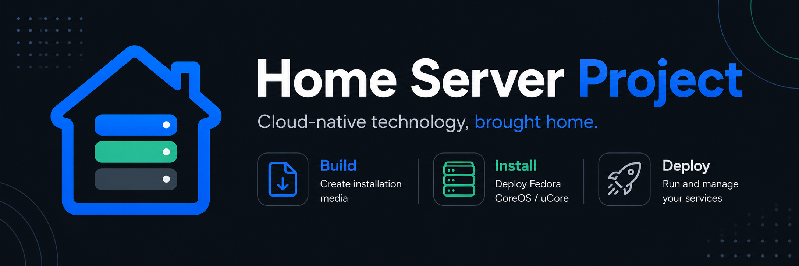

  

# Home Server Project

**Cloud-native technology, brought home.**

Home Server Project exists to make cloud-native home-server technology easier to understand, install, and use on real hardware.

The goal is not to create another Linux distribution or an all-in-one home-server platform. Instead, the project builds on existing upstream technologies and adds a friendlier path for people who want the benefits of Fedora CoreOS, uCore, bootc, Podman, and Quadlets without first needing to become cloud-platform engineers.

## Upstream foundations

Home Server Project builds on:

- [Fedora CoreOS](https://github.com/coreos/fedora-coreos-tracker) — the immutable, automatically updating Fedora CoreOS platform.
- [Universal Blue uCore](https://github.com/ublue-os/ucore) — server-focused images built on Fedora CoreOS.
- [AlmaLinux](https://github.com/AlmaLinux) — the conservative enterprise foundation for the upcoming Home Server Alma bootc path.

The underlying operating system, kernel, bootc stack, container stack, virtualization stack, storage stack, drivers, and core platform engineering remain upstream.

Home Server Project focuses on the home-server experience around those foundations.

## Build. Install. Deploy.

### Build

Create personalized installation media for your own server.

[Home Server uCore Builder](https://github.com/home-server-project/home-server-ucore-builder) is a reusable GitHub template rather than a central ISO factory. A user creates a repository from the template in their own GitHub account, adds one `SSH_PUBLIC_KEY` Actions secret, and runs the build workflow.

The Builder automatically resolves the **latest published Home Server Installer release**, builds from that exact release, and produces a personalized Fedora CoreOS-based installer ISO containing the user's public SSH key.

The Builder does not choose or embed a uCore operating-system image. The finished installer still presents all five supported V1 image choices, and the selected image is downloaded during installation.

### Install

Turn the installation media into a working machine.

[Home Server Installer](https://github.com/home-server-project/home-server-installer) is the interactive installation engine. **V1 is released**, with [`v1.0.0`](https://github.com/home-server-project/home-server-installer/releases/tag/v1.0.0) providing the current direct uCore installation path.

The V1 installer presents five supported installation targets:

- Home Server uCore LTS
- Home Server uCore HCI LTS
- uCore Minimal LTS
- uCore LTS
- uCore HCI LTS

The installer provides target-disk selection, selectable 1 GiB / 2 GiB `/boot` layouts, local user/password setup, and SSH-key configuration while keeping the underlying uCore and Fedora CoreOS model visible to the user.

### Deploy

Run and manage self-hosted services with Podman Quadlets.

Home Server Deployer is planned, but development has not started yet.

The goal is to provide a friendly way to generate and manage customizable Quadlets for common self-hosted applications without hiding the underlying container model from the user.

A future direction may also include assistance with translating Docker Compose configurations into Quadlets, but that is not part of the initial scope.

## Home Server uCore

### Home Server uCore

A lightweight downstream uCore image with a small set of practical host-side administration tools for home servers.

Repository:
https://github.com/home-server-project/home-server-ucore

The project intentionally keeps the custom layer small. Applications that naturally belong in containers stay in containers.

### Home Server Installer

A friendly interactive installation engine for Home Server and upstream uCore images.

Repository:
https://github.com/home-server-project/home-server-installer

Current release: [`v1.0.0`](https://github.com/home-server-project/home-server-installer/releases/tag/v1.0.0)

### Home Server uCore Builder

A GitHub template for building a personalized Home Server Installer ISO in the user's own GitHub account.

Repository:
https://github.com/home-server-project/home-server-ucore-builder

The Builder uses the latest published Installer release, embeds the user's public SSH key, and leaves the operating-system image choice inside the installer.

## Coming soon: Home Server Alma

### Home Server Alma

A more conservative, enterprise-oriented immutable home-server option based on AlmaLinux 10 and `bootc`.

Home Server Alma is intended for users who prefer a slower-moving, RHEL-compatible platform while keeping the same Home Server Project principles:

- immutable / image-based host
- Podman + Quadlets
- small host-side administration layer
- regular and HCI variants
- signed container images

The project is currently in active development and VM testing. It is **not production-ready yet**.

Repository:
https://github.com/home-server-project/home-server-alma

### Home Server Alma ISO

A dedicated installation-media project for Home Server Alma.

This repository is currently empty and will be developed once the Alma image path is ready for installer work.

Repository:
https://github.com/home-server-project/home-server-alma-iso

## Planned projects

### Home Server Deployer

Status: planned.

The Deployer will focus on creating and managing Podman Quadlets for common self-hosted services through a friendly, customizable workflow.

## What this project is not

Home Server Project is not:

- a fork of Fedora CoreOS;
- a fork of uCore;
- a new Linux distribution;
- a replacement for the upstream projects;
- an all-in-one NAS appliance;
- a virtualization-first platform that requires multiple VMs just to run containers.

The project is intended to make a modern, container-native home-server stack more accessible while keeping the underlying architecture understandable.

## Project philosophy

Use strong upstream foundations.

Keep the host operating system small.

Run applications as containers when they belong in containers.

Make installation and deployment understandable.

Do not hide important decisions from the user.

Provide a practical path from bare hardware to a useful home server.

**Cloud-native technology, brought home.**
